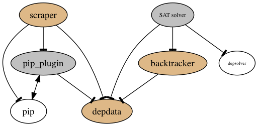

# depresolve
##PyPI package dependency resolution project

depresolve is a project aiming to investigate and address [the problem of package dependency conflicts (Please see background documentation here.)](docs/background.md) in the python package index (PyPI), python's community software repository (commonly accessed via pip). The project provides tools to harvest information and find and resolve conflicts.



(Legend: unfilled ellipses indicate external dependencies. Goldenrod ellipses indicate central components and gray ellipses indicate supporting components.)

The primary components of the project are:
 - [***scraper***](#overview-scraper), a script combined with a pip plugin/branch ([awwad/pip:develop](https://github.com/awwad/pip/)) that serves both to harvest dependency information from pip's processing of packages and to detect package dependency conflicts for those packages, also determining when pip would fail to install the correct package versions in a conflict situation (something that pip is prone to do without notifying the user).
 - [***backtracker***](#overview-resolver) (resolver.resolvability), a module that categorizes and solves package dependency conflicts through a backtracking algorithm, providing a list of the distributions to install that would fulfill package dependency requirements without causing a conflict
 - ***SAT solver*** (resolver.depsolver_integrate), a module that pulls in external project [depsolver](https://github.com/enthought/depsolver) to provide alternative conflict resolution via SAT solving. (Currently out-of-order due to integration bugs)
 - ***deptools*** & ***depdata***, modules that provide a variety of functions for handling package dependency data, upon which the others depend

Along with these components are a few additional scripts for making use of them.


##Resolver Documentation
**The resolver subpackage is a later addition NOT YET DOCUMENTED HERE (TODO) that provides package dependency conflict resolution and assessments of resolvability, also primarily for experimental purposes.**

Two dependency resolvers are provided, a backtracking resolver (depresolve.resolver.resolvability), and a SAT solver (integrating external package enthought/depsolver). Documentation here will refer primarily to the internal backtracking resolver.


###Requirements, Resolver

The backtracking resolver currently has no external dependencies.

The SAT-based resolver requires six (pip install six) and package depsolver (available at (https://github.com/enthought/depsolver)).


###Overview, Resolver

TODOC

###Instructions for Use, Resolver

TODOC


##Scraper / Conflict Detector Documentation

**The first tool here - scrape_deps_and_detect_conflicts collects dependency data and detects package dependency conflicts, focusing on those that pip would fail to correctly handle.**

**While there are multiple modes of execution, the scraper tool's most useful function on its own is that (by default) it answers this question:**

***If I try to install package X via pip in a clean environment configured as it is (Python version, OS, etc.), will pip install a set of packages with all dependencies correctly met?*** (In other words, will pip run headfirst into a dependency conflict and fail to resolve it?)


###Requirements, Scraper
scrape_deps_and_detect_conflicts.py employs awwad/pip, a modified fork of pypa/pip I'm tagging 8.0.0.dev0seb, available at https://github.com/awwad/pip on branch "develop".

By default, the scraper pulls packages straight from PyPI, but can be run using a local .tar.gz sdist, or even from a local bandersnatch'd PyPI mirror. See instructions below.


###Overview, Scraper
[Click here for a quick introduction to dependency conflicts and their resolvability](docs/background.md).

Pip has long had issues with dependency resolution. See for example:
* [Pip doesn't spot conflicting versions](https://github.com/pypa/pip/issues/775#issuecomment-12748095)
* [Pip needs a dependency resolver](https://github.com/pypa/pip/issues/988)
* [pip install -r does not respect package dependencies](https://github.com/pypa/pip/issues/3183)
* [the name of the dependency problem](https://code.activestate.com/lists/python-distutils-sig/25512/)

The scraper's script, scrape_deps_and_detect_conflicts.py, given a package name and version or a source distribution (sdist) .tar.gz, calls a modified fork of pip with special arguments. Via the modified pip code, the scraper runs the initial (pre-install) portion of the pip install process for a list of packages. As it does so, it also:
  - Harvests dependency info:
    - Harvests all dependency information that pip extracts from the packages (and packages the packages depend on, and packages *those* packages depend on, etc) and stores it in a dependencies.json file in the data directory. (This process is cumulative for additional runs and tries not to duplicate work.) Because dependencies are essentially determined at runtime (of setup.py for the package), these dependencies may vary somewhat for some packages on some environments. (That is a property of PyPI and pip's design.)
  - Detects conflicts:
    - Detects dependency conflicts via three models/definitions of a dependency conflict, and stores (and reads from) information on these in a set of conflicts_n.json files stored in the data directory. Avoids work duplication by not repeating for a given dist (package name and version) if conflict info for that package already exists (unless --noskip is on).
      - Dependency Conflict definitions: In each conflict model, we say that a conflict exists for package R if in the tree, rooted at R, of install candidates selected by pip given an instruction to install package R, some package C is depended on by packages A and B, and...:
        - Model 1: ... and the dependency specification (requirement strings) of packages A and B for package C are not identical (e.g. A depends on C==3.0 and B depends on C>=1, regardless of the available versions). *This encompasses all dependency conflicts, both resolvable and unresolvable.*
        - Model 2: ... and the dependency specification (requirement strings) of packages A and B are such that pip's first choice package (based on its internal prioritization -- TODO: add link to that code here) to resolve those two dependencies would not be the same package. (e.g. A depends on C==3.0 and B depends on C>=1, and the most recent version is > 3.0.) *This encompasses all unresolvable and some resolvable dependency conflicts.*
        - Model 3: ... and pip selects a final set of install candidates that would not fulfil all of those candiates (and the initial) requirement specifications. (e.g. A depends on C==3.0 and B depends on C<=2.5) *This encompasses all unresolvable and some resolvable dependency conflicts. It is, in summary, specifically where pip fails to provide for the user's request.* MODEL 3 IS DONE BUT IN TESTING
  - Blacklists packages:
    - Produces & reads from a blacklist_db.json file (in the directory from which scrape_deps_and_detect_conflicts.py is called) that prevents packages that pip code is unable to parse from being touched again by this project while running with the same major version of python. This addresses the issue of a substantial fraction of packages being installable only on a python 3 environment (or only on a python 2 environment), along with the issue of badly behaved packages that pip would not be able to install, along with the issue of (old) packages that are not compliant with the current version of pip and that pip would no longer be able to install.

Note that all skipping based on blacklisting or data on the existence / lack of a conflict for a given package (package name & version) can be avoided by use of argument --noskip.


###Instructions for use, Scraper

1.  git clone https://github.com/awwad/depresolve
2.  cd depresolve
2.  virtualenv -p python3 --no-site-packages v3
3.  source v3/bin/activate
4.  pip install -e .
4.  cd ..
11. git clone https://github.com/enthought/depsolver
12. cd depsolver
13. pip install -e .
14. cd ..
5.  git clone https://github.com/awwad/pip
6.  cd pip
9.  pip install -e .     # (For convenience, this installs in editable mode. Reference here: https://pip.pypa.io/en/stable/reference/pip_install/#editable-installs )
10. cd ../depresolve
13. python depresolve/scrape_deps_and_detect_conflicts.py "motorengine(0.7.4)" --noskip      # (to run this on version 0.7.4 of package motorengine, from remote PyPI, not skipping if the package has already been analyzed, using conflict model 3. This example has a model 3 conflict, so you should see an error explaining that.)
14. 

Detailed info on calling the script:

```
Argument handling:
 DEPENDENCY CONFLICT MODELS (see README)
  --cm1    run using conflict model 1 (all resolvable and unresolvable conflicts; see README)
  --cm2    run using conflict model 2 (all unresolvable and some resolvable conflicts; see README)
  --cm3    run using conflict model 3 (default; basically "would pip get this right?"; see README)

 GENERAL ARGUMENTS:
  --noskip Don't skip packages in the blacklist or packages for which information on
           whether or not a conflict occurs is already stored.

 REMOTE OPERATION:   (DEFAULT!)
   ANY ARGS NOT MATCHING the other patterns are interpreted as what I will refer to as 'distkeys':
     packagename(packageversion)
     e.g.:   "django(1.8)"
     Using one of these means we're downloading from PyPI, per pip's defaults.
     Your shell will presumably want these arguments passed in quotes because of the parentheses.


 LOCAL OPERATION: For use when operating with local sdist files (e.g. with a bandersnatched local PyPI mirror)
  --local=FNAME  specifies a local .tar.gz sdist to inspect for dependency conflicts with pip
                 for dependency conflicts
                 e.g. '--local=/srv/pypi/web/packages/source/M/motorengine/motorengine-0.7.4.tar.gz'
                 You can specify as many of these as you like with separate --local=<file> arguments.
                 Local and remote execution are mutually exclusive.
  --local  Using this without "=<file.tar.gz>" means we should alphabetically scan from the local PyPI mirror.
           This is mutually exclusive with the --local=<fname> usage above. If files are specified, we only
           check the files specified.

  --n=N    For use only with --local (not remotes, not --local=<file>).
           Sets N as the max packages to inspect when pulling alphabetically from local PyPI mirror.
           e.g. --n=1  or  --n=10000
           Default for --local runs, if this arg is not specified, is all packages in the entire local PyPI
           mirror at /srv/pypi)
           (TODO: Must confirm that using this arg won't impact remote operation, just for cleanliness.)


  EXAMPLE CALLS, SCRAPER:

     ~~ Run on a single package (in this case, arnold version 0.3.0) pulled from remote PyPI,
        using conflict model 3 (default):

         >  python scrape_deps_and_detect_conflicts.py "arnold(0.3.0)"


     ~~ Run on a few packages from PyPI, using conflict model 2, and without skipping even if
        conflict info on those packages is already available, or if they're in the blacklist for
        having hit unexpected errors in previous runs:

         >  python scrape_deps_and_detect_conflicts.py "motorengine(0.7.4)" "django(1.6.3)" --cm2 --noskip


     ~~ Run on a single specified package, motorengine 0.7.4, stored locally, using conflict model 2:

         >  python scrape_deps_and_detect_conflicts.py --cm2 --local=/srv/pypi/web/packages/source/M/motorengine/motorengine-0.7.4.tar.gz

     ~~ Run on the first 10 packages in the local pypi mirror (assumed /srv/pypi) alphabetically,
         using conflict model 1.

         >  python scrape_deps_and_detect_conflicts.py --cm1 --local --n=10
```  


###Old content

Comments on manual_package_dependency_extraction.py: 
This script handles manual parsing of setup.py files, without employing pip, and simply extracts dependencies. It is no longer in use and is replaced by scrape_deps_and_detect_conflicts.py.
