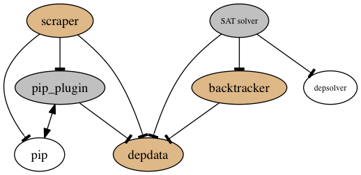

# depresolve
##PyPI package dependency resolution project

depresolve is a project aiming to investigate and address [the problem of package dependency conflicts (Please see brief background documentation here!)](docs/background.md) in the python package index (PyPI), python's community software repository (commonly accessed via pip). The project provides tools to harvest information and find and resolve conflicts.



(Legend: unfilled ellipses indicate external dependencies. Goldenrod ellipses indicate central components and gray ellipses indicate supporting components.)

The primary components of the project are:
 - [***scraper***](#overview-scraper), a script combined with a pip plugin/branch ([awwad/pip:develop](https://github.com/awwad/pip/)) that serves both to harvest dependency information from pip's processing of packages and to detect package dependency conflicts for those packages, also determining when pip would fail to install the correct package versions in a conflict situation (something that pip is prone to do without notifying the user).
 - [***backtracker***](#overview-resolver) (resolver.resolvability), a module that categorizes and solves package dependency conflicts through a backtracking algorithm, providing a list of the distributions to install that would fulfill package dependency requirements without causing a conflict
 - ***SAT solver*** (resolver.depsolver_integrate), a module that pulls in external project [depsolver](https://github.com/enthought/depsolver) to provide alternative conflict resolution via SAT solving. (Currently out-of-order due to integration bugs)
 - ***deptools*** & ***depdata***, modules that provide a variety of functions for handling package dependency data, upon which the others depend

Along with these components are a few additional scripts for making use of them.


##Installation of scraper and resolver
1. `git clone https://github.com/awwad/depresolve`
2. `cd depresolve`
3. `virtualenv -p python2 --no-site-packages v2`
3. `source v3/bin/activate`
4. `pip install -e .`
5. `cd ..`
6. `git clone https://github.com/enthought/depsolver`
7. `cd depsolver`
8. `pip install -e .`
9. `cd ..`
10.  `git clone https://github.com/awwad/pip`
11.  `cd pip`
12.  `pip install -e .`

Notes:
- Those installs must be done in that order for the scraper to work.
- Python version 2 is suggested above because the external SAT solver has python 3 compatibility issues. The rest of the project is 2/3 compatible, so if you don't intend to use the external SAT solver, feel free to use python 3.
- `pip install -e` installs a package in editable mode, for development convenience. Reference here: https://pip.pypa.io/en/stable/reference/pip_install/#editable-installs)
- enthought/depsolver is not necessary if you do not wish to use the SAT solver-based resolver.
- The awwad/pip installation is not necessary if you will not be using the scraper to harvest dependencies and detect conflicts, but have dependency data from another source, like:
- **[You can download my data, compiled for you here!](https://www.dropbox.com/sh/2x870eosiknww68/AAArQBivh2jlu6auqNLHsm1Ja?dl=0))**. Dependency data for all PyPI packages, conflict data, and solution data there is calculated from a rough PyPI mirror current in late 2015. What you choose to use should be placed in the data/ directory in the main depresolve directory. The data there was crunched on an Ubuntu machine, generally running python 3 within a minimal virtualenv, from hundreds of thousands of abbreviated package installs. :P You can pull it from dropbox at the link provided or download all of it (52MB zipped) via shell like so:
  - `curl -L -o dep_data.zip https://www.dropbox.com/sh/2x870eosiknww68/AAArQBivh2jlu6auqNLHsm1Ja?dl=1`
  - `unzip dep_data.zip`


##Resolver Documentation
**The resolver subpackage is a later addition NOT YET DOCUMENTED HERE (TODO) that provides package dependency conflict resolution and assessments of resolvability, also primarily for experimental purposes.**

Two dependency resolvers are provided, a backtracking resolver (depresolve.resolver.resolvability), and a SAT solver (integrating external package enthought/depsolver). Documentation here will refer primarily to the internal backtracking resolver.


###Requirements, Resolver

The backtracking resolver currently has no external dependencies and has been tested in python 2.7, 3.4, and 3.5.

The SAT-based resolver requires six (pip install six) and package depsolver (available at (https://github.com/enthought/depsolver)). External package depsolver seems to be python 3 incompatible, but runs on python 2.7.


###Overview, Resolver

TODOC

The backtracking resolver in its current form consumes a dictionary of all dependencies of all relevant packages, and, when given the name of a distribution (e.g. 'motorengine(0.7.4)', what I term a distribution key or distkey), will attempt to find a set of distributions to install that fulfills all dependencies without a dependency conflict. It does this by recursing through the tree of dependencies and gradually building up a set of nonconflicting candidates. (My data is available as indicated in the notes of [the install section above](#installation-of-scraper-and-resolver).)

In a future revision, the backtracker will determine dependencies dynamically as it goes, not requiring a separate scraping process to already have occurred.


###Instructions for Use, Resolver

TODOC

Assume data/dependencies.json contains a dictionary of all distributions' dependencies, indexed by distribution key, elaborated via `depresolve.deptools.elaborate_dependencies(deps, versions_by_package)`. (For format details, see [depresolve/depdata.py](depresolve/depdata.py). To download, see [above](#installation-of-scraper-and-resolver).)

```
>>> import depresolve.deptools as deptools
>>> import depresolve.resolver.resolvability as ry
>>> import json
>>> edeps = json.load(open('data/elaborated_dependencies.json', 'r'))
>>> versions_by_package = deptools.generate_dict_versions_by_package(edeps)
>>> solution = ry.backtracking_satisfy('motorengine(0.7.4)', edeps,
      versions_by_package)

```

`solution` should then be: `['pymongo(2.5)', 'motor(0.1.2)', 'backports-abc(0.4)', 'tornado(4.3)', 'six(1.10.0)', 'greenlet(0.4.9)', 'motorengine(0.7.4)', 'easydict(1.6)']`

This is a list of the distributions to install in order to have a fully satisfied (all dependencies fulfilled) install of motorengine version 0.7.4, with no dependency conflicts.

If the resolver is unable to find a non-conflicting solution, it will raise a depresolve.UnresolvableConflictError, indicating that there is no solution. (At present, while the backtracking resolver resolves most conflicts, it misses a class of solutions, and so there may indeed be a solution it cannot find. See [Issue #12](https://github.com/awwad/depresolve/issues/12).)


##Scraper / Conflict Detector Documentation

**The first tool here - scrape_deps_and_detect_conflicts collects dependency data and detects package dependency conflicts, focusing on those that pip would fail to correctly handle.**

**While there are multiple modes of execution, the scraper tool's most useful function on its own is that (by default) it answers this question:**

***If I try to install package X via pip in a clean environment configured as it is (Python version, OS, etc.), will pip install a set of packages with all dependencies correctly met?*** (In other words, will pip run headfirst into a dependency conflict and fail to resolve it?)


###Requirements, Scraper
scrape_deps_and_detect_conflicts.py employs awwad/pip, a modified fork of pypa/pip I'm tagging 8.0.0.dev0seb, available at https://github.com/awwad/pip on branch "develop".

By default, the scraper pulls packages straight from PyPI, but can be run using a local .tar.gz sdist, or even from a local bandersnatch'd PyPI mirror. See instructions below.


###Overview, Scraper
The scraper's script, scrape_deps_and_detect_conflicts.py, given a package name and version or a source distribution (sdist) .tar.gz, calls a modified fork of pip with special arguments. Via the modified pip code, the scraper runs the initial (pre-install) portion of the pip install process for a list of packages. As it does so, it also:
  - Harvests dependency info:
    - Harvests all dependency information that pip extracts from the packages (and packages the packages depend on, and packages *those* packages depend on, etc) and stores it in a dependencies.json file in the data directory. (This process is cumulative for additional runs and tries not to duplicate work.) Because dependencies are essentially determined at runtime (of setup.py for the package), these dependencies may vary somewhat for some packages on some environments. (That is a property of PyPI and pip's design.)
  - Detects conflicts:
    - Detects dependency conflicts via three models/definitions of a dependency conflict, and stores (and reads from) information on these in a set of conflicts_n.json files stored in the data directory. Avoids work duplication by not repeating for a given dist (package name and version) if conflict info for that package already exists (unless --noskip is on).
      - Dependency Conflict definitions: In each conflict model, we say that a conflict exists for package R if in the tree, rooted at R, of install candidates selected by pip given an instruction to install package R, some package C is depended on by packages A and B, and...:
        - Model 1: ... and the dependency specification (requirement strings) of packages A and B for package C are not identical (e.g. A depends on C==3.0 and B depends on C>=1, regardless of the available versions). *This encompasses all dependency conflicts, both resolvable and unresolvable.*
        - Model 2: ... and the dependency specification (requirement strings) of packages A and B are such that pip's first choice package (based on its internal prioritization -- TODO: add link to that code here) to resolve those two dependencies would not be the same package. (e.g. A depends on C==3.0 and B depends on C>=1, and the most recent version is > 3.0.) *This encompasses all unresolvable and some resolvable dependency conflicts.*
        - Model 3: ... and pip selects a final set of install candidates that would not fulfil all of those candiates (and the initial) requirement specifications. (e.g. A depends on C==3.0 and B depends on C<=2.5) *This encompasses all unresolvable and some resolvable dependency conflicts. It is, in summary, specifically where pip fails to provide for the user's request.*
  - Blacklists dists:
    - Produces & reads from a blacklist_db.json file (in the directory from which scrape_deps_and_detect_conflicts.py is called) that prevents versions of packages (dists) that pip code is unable to parse from being touched again by this project while running with the same major version of python. This addresses the issue of a substantial fraction of packages being installable only on a python 3 environment (or only on a python 2 environment), along with the issue of badly behaved packages that pip would not be able to install, along with the issue of (old) packages that are not compliant with the current version of pip and that pip would no longer be able to install.

Note that all skipping based on blacklisting or data already available on the existence / lack of a conflict for a given package (package name & version) can be avoided by use of argument --noskip.

The scraper is configured to timeout on any given distribution if pip takes longer than 5 minutes to process it. This will not add the distribution to the blacklist.

TL;DR: The primary outputs of the scraper come in the form of dependencies.json and conflicts_3.json. [Formats explained in docstring here](depresolve/depdata.py).


###Instructions for use, Scraper
Detailed documentation on the arguments to the scraper script is available in the docstrings within [scrape_deps_and_detect_conflicts.py](depresolve/scrape_deps_and_detect_conflicts.py).

Here are some use examples:

- Run the scraper on version 0.7.4 of package motorengine, using packages from PyPI, not skipping if the package has already been analyzed, using conflict model 3. This example has a model 3 conflict, so you should see an error explaining that.)
  - `python depresolve/scrape_deps_and_detect_conflicts.py "motorengine(0.7.4)" --noskip`

- Run on a single package (in this case, arnold version 0.3.0) pulled from remote PyPI, using conflict model 3 (default):
  - >>> `python scrape_deps_and_detect_conflicts.py "arnold(0.3.0)"`

- Run on a few packages from PyPI, using conflict model 2, and without skipping even if conflict info on those packages is already available, or if they're in the blacklist for having hit unexpected errors in previous runs:
  - >>>  `python scrape_deps_and_detect_conflicts.py "motorengine(0.7.4)" "django(1.6.3)" --cm2 --noskip`

- Run on a single specified package, motorengine 0.7.4, stored locally, using conflict model 2:
  - >>> `python scrape_deps_and_detect_conflicts.py --cm2 --local=/srv/pypi/web/packages/source/M/motorengine/motorengine-0.7.4.tar.gz`

- Run on the first 10 packages in the local pypi mirror (assumed /srv/pypi) alphabetically, using conflict model 1.
  - >>> `python scrape_deps_and_detect_conflicts.py --cm1 --local --n=10`


####Interpreting Scraper Results

