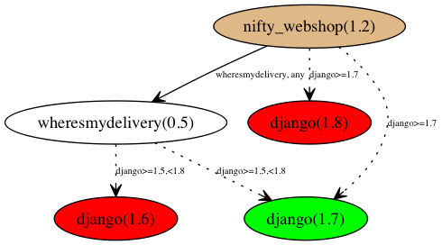

# Dependency Resolution Background

##Resolvable Dependency Conflicts

Installation of a package may require a number of other packages, making these other packages dependencies of the first.

#### Example 1: Innocence

Your project, nifty-webshop, a storefront webapp, depends on django. Version 1.1 of nifty-webshop is be written in python 3.4, and therefore needs a version of django >= 1.7 (which is required for python 3.4+ support). You'd configure your package to list django>=1.7 as an install requirement, and so when a user runs `pip install nifty-webshop`, pip will grab the latest version of your nifty-webshop package, 1.1, figure out its dependencies (django>=1.7), fetch the latest version of django, and install both that and nifty-webshop. Success!

#### Example 2

Suppose you expand your successful project, releasing nifty-webshop 1.2, which can do some fun new things like delivery tracking by taking advantage of someone else's open source webapp, wheresmydelivery. nifty-webshop depends, then, on django>=1.7, and on wheresmydelivery (any version). Now, when a user tries to `pip install nifty-webshop`, pip will fetch nifty-webshop(1.2) and see that it requires django>=1.7 and wheresmydelivery. pip will fetch both and see that the latest version of wheresmydelivery, wheresmydelivery(0.5), requires django>=1.5,<1.8. (Some of the django 1.8 changes break wheresmydelivery!)

You can see that now we have a potential **dependency conflict**! nifty-webshop needs django, and nifty-webshop needs wheresmydelivery, which also needs django... but the version ranges they need are not the same. In order to get a functioning set of installs (or at least an install set that satisfies all the various developers' stated requirements ^_^), we need to choose a version of django that satisfies both dependencies. In this case, it has to be django 1.7.x. Anything more or less fails to meet one of the requirements and breaks nifty-webshop directly or indirectly (by breaking wheresmydelivery). So, pip just has to install one of those, and all dependencies are met. That makes this dependency conflict **resolvable**: there is at least one solution that satisfies all stated dependencies. (Some conflicts are unresolvable - a discussion of these is left for further down.)

The process of finding a set of package versions/dists that satisfies all requirements constitutes the problem of dependency resolution.

## How Common are Conflicts?

In a community of developers relying on each other's code, where new versions are released on a regular basis, the question of how common conflicts are depends strongly on the way that we define a conflict. For PyPI, in a clean environment, the percentage of dists whose dependencies create a conflict is somewhere between 1% and 25%. In practice, I will use the conservative figure of 1.3% (conflict model 3, the percentage of dists that pip actually gets wrong, with all other sources of error removed). [See the section below for an explanation of these conflict models and prevalence figures](#conflict-prevalence-and-models).

## Status Quo: pip doesn't actually resolve conflicts at all!

Unfortunately, when you `pip install nifty-webshop`, the simple process of resolution highlighted above is not what actually happens, because [pip lacks a real dependency resolver](https://github.com/pypa/pip/issues/988)1. pip's approach is not a careful one, but rather a first-come-first-served approach that fails to recognize package conflicts. In the example above, it is likely that pip would grab nifty-webshop(1.2), django(1.9.x), and wheresmydelivery(0.5), install them all, and not even realize that it just broke the package it installed and provided the user a nonfunctioning install set. Thinking they've successfully installed, the user would at some point get arcane errors from wheresmydelivery because the version of django installed is not actually compatible with wheresmydelivery, and would break it. The performance of pip varies in this regard, and approximately 1.6% of dists currently on PyPI are packages with dependency conflicts that pip fails to resolve. (TODO: Link here to data when it's posted.) The number of hours users and developers lose debugging such *foreseeable problems* is not knowable. **It is noteworthy that this struggle would be improved by simply consistently notifying users (and, conditional on environment assumptions, even package uploaders and maintainers) of the existence of a conflict in the set of install candidates pip selects when instructed to install a package.**

As for automatic resolution of the dependency conflict problem, common approaches to finding a packaging dependency solution are **backtracking resolution** and **satisfiability (SAT) solving**.

## SAT Solving vs Blind Backtracking

The dependency conflict problem plagues package managers in general, and SAT solving, as the highly optimized and well studied discipline, is automatically the privileged candidate; however, PyPI is slightly special. PyPI package dependencies are not known until install time, i.e. are not fixed metadata; a package can actually dynamically decide what its dependencies are at install time, based on a user's environment (or any other arbitrary reason). *In order to determine what a given version of a package's dependencies are, pip downloads that package and processes it.*

Consequently, for us, there is a substantial problem with a general SAT solver: that a SAT solver requires complete information about the dependency tree to begin. While in most practical cases, dependencies are static, dependency information does not *necessarily* exist independently of user environments. In particular, this means that unless we are willing to dictate or assume static package dependencies (and store them in some central dictionary - about 30MB - that every user would need and which is likely to occasionally diverge from the real dependencies they see), then **in order to SAT solve dependencies with a general SAT solver, a user would have to determine package dependency information for every applicable version of every dependend-on package, acquiring all the possible packages and processing their setup.py files.** That is massive overhead.

 By comparison, a backtracking resolver can simply pull package information as it is needed, and hope that the solution appears readily. What it loses in efficiency is likely to pale in comparison to the gains in not having to obtain and process a large number of distributions (django 1.7.1, 1.7.2, 1.7.3, 1.7......).

 It may be that a hybrid solution may prove worthwhile, with a centrally calculated solution set generated on some common environment and partially recalculated when new packages surface. The solution for a requested package X would be given to users when they try to install package X, and, if that fails for the user, backtracking can take over.

##Addenda

###Conflict Prevalence and Models

####Conflict Model 1 - Nonidentical Requirement Strings
25% of a sample of 23,134* dists possesses a configuration of dependencies that is potentially conflict-inducing, like that in the situation given above. That is to say that somewhere in the dependency tree rooted at some dist you want to install, there are two (or more) nonequivalent constraints applied to the same depended-on package. For example: X-1 depends on B-any and C-any, and C-2 depends on B==1. This fits conflict model 1, because there are two different requirements on B (in this case: any and ==1).

####Conflict Model 2 - Nonidentical Dist Selection
I define a model 2 conflict as a scenario in which pip's first choices for two (or more) dependencies on the same package are not the same.

5% of a sample of 25,707* dists possesses a configuration of dependencies such that if pip were to select the best candidate to satisfy one dependency, it would conflict with the best candidate to satisfy another dependency.

For example, consider this case:
Three packages, [X, B, C], each have two versions [1, 2]. pip will prefer the highest version number possible when it selects a dist to satisfy a dependency. If X depends on any B and any C, but C-2 depends on B-1 specifically, then pip would choose B-2 to satisfy X-2, but B-1 to satisfy C-2. This constitutes a model 2 conflict: pip's first choices for each dependency don't all match.

(* The marked samples are neither random nor consciously selected, but instead just the first x dists in an alphabetical order walk of the PyPI package tree, ending after a prescribed time for collection, discounting packages that the current version of pip was unable to process.)

####Conflict Model 3 - Current pip Failures
The most pragmatic (and somewhat limited) conflict model I use is in effect "Does pip get it wrong?", or, more precisely: "Given a request to install dist X-1, does pip pick candidates to satisfy dependencies that don't actually satisfy all the dependencies of all the dists to be installed?""

1.3% of a sample of 260,660** dists on PyPI have such a conflict.

(** This constituted a test of every version of every package available on a local mirror of PyPI that pip was able to parse on my testing rig.)

This may be the most useful figure when discussing how to improve pip, but it is good to remember that this ignores other cases like those in conflict model 2, where any new release could result in a conflict. That pip doesn't run into the conflict is not an assurance that it is doing the right thing - it is often just lucky, or a result of developers doing extra work before uploading a package to pin versions so that things at least install for now.

###Problem #2: Unresolvable Dependency Conflicts

Further complicating matters, not all dependency conflicts *are* resolvable.

--TODO: Expand on a real example of an unresolvable conflict, explaining a few ways these happen. Even if a developer is mindful about the dependencies of her dependencies at dev time, new versions or different platforms can result in etc. etc. etc.--

###Further background
1The lack of dependency resolution for pip is established. See for example:
* [Pip doesn't spot conflicting versions](https://github.com/pypa/pip/issues/775#issuecomment-12748095)
* [Pip needs a dependency resolver](https://github.com/pypa/pip/issues/988)
* [pip install -r does not respect package dependencies](https://github.com/pypa/pip/issues/3183)
* [the name of the dependency problem](https://code.activestate.com/lists/python-distutils-sig/25512/)