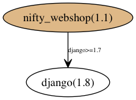

# Dependency Resolution Background

##Resolvable Dependency Conflicts

Installation of a package may require a number of other packages, making these other packages dependencies of the first.

#### Example 1: Innocence

Your project, nifty-webshop, a storefront webapp, depends on django. Version 1.1 of nifty-webshop is written in python 3.4, and therefore needs a version of django >= 1.7 (Earlier django versions do not support python 3.4+.). You'd configure your nifty-webshop package to list django>=1.7 as an install requirement, and so when a user runs `pip install nifty-webshop`, pip will grab the latest version of your nifty-webshop package, 1.1, figure out its dependencies (django>=1.7), fetch the latest version of django, and install both that and nifty-webshop. Success!

#### Example 2

Suppose you expand your successful project, releasing nifty-webshop 1.2, which can do some fun new things like delivery tracking by taking advantage of someone else's open source webapp, wheresmydelivery. nifty-webshop depends, then, on django>=1.7, and on wheresmydelivery (any version). Now, when a user tries to `pip install nifty-webshop`, pip will fetch nifty-webshop(1.2) and see that it requires django>=1.7 and wheresmydelivery. pip will fetch both and see that the latest version of wheresmydelivery, wheresmydelivery(0.5), requires django>=1.5,<1.8. (Some of the django 1.8 changes break wheresmydelivery!)

We now have a **potential dependency conflict**: nifty-webshop needs django, and nifty-webshop needs wheresmydelivery, which also needs django... but the version ranges of django that they need are not the same. In order to get a functioning set of installs (or at least an install set that satisfies all projects' stated requirements), pip (or the user) needs to choose a version of django that satisfies both dependencies. In this case, it has to be django 1.7.x. Anything more or less fails to meet one of the requirements and breaks nifty-webshop directly or indirectly (by breaking wheresmydelivery). So, pip just has to install one of those, and all dependencies are met. That makes nifty-webshop(1.2)'s dependencies **resolvable**: there is at least one solution that satisfies all stated dependencies (and theirs and theirs, etc). (Some dependencies are **unresolvable** due to unavoidable conflicts - a discussion of these is left for further down.)

The process of finding a set of package versions/dists that satisfies all requirements constitutes the problem of dependency resolution.

## What is a Dependency Conflict and How Common Are They?

### Defining Conflict
Please feel free to [skip ahead](#prevalence-of-conflict) and come back only if you need semantic clarity - else, bear with me for these tedious semantics.

Terminology around dependency conflicts is not always consistent. I've referred to the nifty-webshop scenario above as having a **potential** conflict. I'm looking at a dependency conflict as something that happens when a set of installed packages is not fully resolved - that is, when not all dependencies are met by satisfactory versions - due to different packages having different demands on the versions of other packages. Having a conflict is a property of a set of distributions - not a property of a specific distribution's dependency tree. Some people would say instead that in the scenario above, there are conflicting dependencies, and so there is a dependency conflict that just happens to be resolvable, regardless of what is or is not installed - in this alternative definition, having a dependency conflict would be a property of the graph of dependencies, rather than the state of what is installed. I will try not to use that terminology here, as I think it can be confusing. For reference and to (hopefully) settle things for anyone who finds things unclear, here are the strict definitions I'll use:

**Potential dependency conflict**: *Distribution A-1's dependencies exhibit a potential dependency conflict if there are multiple non-identical constraints on the acceptable versions of at least one depended-on package in A's dependencies.* For example: A-1 depends on B-1 and C; B-1 depends on C; the A-on-C and B-on-C dependencies are not identical (even if they overlap). The nifty-webshop scenario certainly fits this definition.  ~~(In the past, I have referred to this as a "model 1 conflict".)~~ This is extremely common, with a lower bound of 22% of distributions on PyPI.  (The lower bound is about 32% of the distributions with any dependencies at all.)

**Unresolved dependency**: *A set of distributions S has an "unresolved dependency" if there is a distribution in S with a dependency that is not satisfied by one of the distributions in S.* S = [A-1, B-1] is unresolved if, e.g., B-1 depends on C-2. (C-2 is not in S.) S = [A-1, B-1, C-1] is also unresolved, for the same reason. In the latter case, unlike the former, there is a dependency conflict:

**Dependency conflict**: *A set of distributions S has a "dependency conflict" if any dependency of any of the distributions in S is not satisfied by a distribution in S (i.e. is unresolved) due to a version mismatch.* This is one of the potential causes for an unresolved dependency. (Others include unavailable versions or install errors.) We might also say that such dependencies are not "fully resolved". For example, the set [A-1, B-1, C-1] has a dependency conflict if, for example, B-1 depends on C>=1.1. If pip were to try to install that set, it would be creating a dependency conflict. ~~(In the past, where pip generates such a scenario, I have referred to this as a "model 3 conflict".)~~

**Unresolv*able* dependencies**: *Distribution A-1's dependencies are unresolvable if there does not exist a set S of distributions that includes A-1 and has no unresolved dependencies.* Example unresolvable dependencies: A-1 depends on B==1 and C==1, and B-1 depends on C==1.1. That conflict is inevitable. More information on unresolvable conflicts is available [below](#problem-2-unresolvable-dependency-conflicts). Since developers usually test with at least one working configuration of dependencies, this is quite rare in practice, and likely a result of incorrectly written dependency/requirement strings. My upper bound for the distributions on PyPI with unresolvable dependencies (with all other error cases - like a setup.py that pip cannot parse - set aside) is less than 0.5%. The real figure is likely to be substantially lower. Later, I will also refer to conflicts as "resolved" or "unresolved" by pip.

**Resolv*able* dependencies**: *Distribution A-1's dependencies are resolvable if there exists a set S of distributions that includes A-1 and has no unresolved dependencies.* The nifty-webshop example was resolvable: the use of a Django 1.7.x package averts the potential conflict. It is worth nothing that if the dependencies had been pinned instead of being as open-ended as they were, the dependencies could have been unresolvable, the conflict inevitable.

### Prevalence of Conflict

That wall of text now behind us, the basics are this: potential dependency conflicts are extremely common, if not downright expected anytime there is a common dependency among distributions. Despite the potential, though, these dependencies are still usually resolvable. In practice, if you just aim for the most recent versions (which pip does anyway), you can avoid most dependency conflicts... but not all. Next, we'll get to the statistics on pip failures, and by the end, we'll have discussed several possible mitigations (with and without changes to pip).

#### Prevalence of Potential Dependency Conflicts

*It turns out that almost a quarter of all package versions on PyPI have potential dependency conflicts+*. Because of the behavior of most package managers, these cases are *mostly* OK: most of the time, dependency ranges overlap and the same version (generally the most recent stable version) is chosen. A common case looks like: A depends on C>=1.1 and B depends on C>=1.2, and the latest version of C is 1.4 anyway. Given an option, pip will generally install the latest available version of a package, so this scenario is only an issue if the user already has, say, C==1.2 installed.

For this reason, *most* potential conflicts are averted by the usual pip installation rules, as long as you're installing in an empty, clean, isolated environment (e.g. with a fresh virtualenv). This is a suboptimal constraint, but it covers most cases in effect. Notwithstanding even those mitigations, there are still plenty of dependencies pip fails to resolve.

Some questions we should ask, then, are:
1. How many distributions on PyPI have potential dependency conflicts? (*At least 25%.*)
2. How often does pip install a set of packages with an actual conflict? (In other words, how often does pip fail to resolve dependencies due to a dependency conflict?) (*1.3%*)

+(This is a conservative floor on the number of distributions with potential dependency conflicts. It is generated by climbing down along one side of the dependency tree: in particular, when given a range of possible versions, we always explore only the version pip prefers within that range (generally the highest version number). The effect this has is to fail to capture a great number of potential dependency conflicts. Example: A-1 depends on B-any and C-any, B-1 depends on C-1, B-2 depends on C-2. My assessment does not explore B-1 and therefore does not catch the potential conflict because it does not see these conflicts: [A-1, B-2, C-1], [A-1, B-1, C-2]. In a clean environment with a connection to current PyPI and no separate dependencies, we would not expect to encounter those conflicts... but *if those things aren't true*, we might.)

Eliminated text: ~~The nifty-webshop scenario above only a **potential** conflict, and only use the term "conflict" to describe the runtime situation where wheresmydelivery tries to run and finds it has an unacceptable version of django. Others might, instead, consider it an install-time scenario but only use the term "conflict" if there is no possible version of django that could be chosen to satisfy the two dependencies on django (FWIW, I would call that an unresolvable conflict.).~~

~~We should now divide the group of dependency conflicts into resolvable and unresolvable. We say that a dependency conflict is resolvable if there is a solution that fulfils all dependencies, and unresolvable if such a solution does not exist. The nifty-webshop example was resolvable: the use of a django 1.7.x package resolves the conflict. If the dependencies had been pinned instead of being as open-ended as they were, this could have been an unresolvable conflict. Example: A-1 depends on B==1 and C==1, and B-1 depends on C==1.1. That conflict is unresolvable. More information on unresolvable conflicts is available [below](#problem-2-unresolvable-dependency-conflicts). Later, I will also refer to conflicts as "resolved" or "unresolved" by pip.~~

## Mitigations By Developers

As a package maintainer, you could remove ambiguity and somewhat mitigate the threat of a potential dependency conflict if you pin versions for every package your distribution depends on (and every package *those* depend on and so on)... but then that opens you up to dependency conflicts in the future - or even right away if your users don't all use a clean, single-purpose virtualenv to use your project, with no additional/external dependencies. As a side effect, pinning everything also makes it more likely that users will have to persist in the use of outdated packages even after they have, for example, had security vulnerabilities updated. If you pin packages, then you need to release *every time an important release of anything you depend on comes out, or anything anything you depend on depends on comes out, and so on.*. In general, pinning increases the number of users we can expect to have outdated dependencies, and the number of outdated dependencies they'll have.

So while conflicting dependencies are common in PyPI, 

We could narrow the definition by saying that a dependency conflict exists when different dependencies on the same package have different most-recent-versions. Then the A-B-C example above has no conflict, as both A's and B's dependencies on C would result in the selection of version 1.4 of C. However, the nifty-webshop 1.2 scenario still has a conflict, since wheresmydelivery's most recent acceptable version of django is 1.7.11 and nifty-webshop itself's most recent acceptable version is 1.9.7. Under this definition, about 5% of the package versions on PyPI have dependency conflicts. I'll call this "conflict model 2" and move on.

Model 3:
If, like me, what you're most concerned about is the real-world scenario wherein a user types 'pip install nifty-webshop', then we can be messy and narrow things down further. We could define a dependency conflict as the scenario in which pip picks 

For PyPI, in a clean environment, the percentage of dists whose dependencies create a conflict is somewhere between 1% and 25%. In practice, I will use the conservative figure of 1.3% (conflict model 3, 'pip failures', the percentage of distributions that pip actually gets wrong when it tries to install them, with all other sources of error removed). This turns out not to just be a matter of a few outliers, either: the proportion is 2-2.5% for the distributions of the 1000 most common packages on PyPI. [See the section below for an explanation of these conflict models and prevalence figures](#conflict-prevalence-and-models).

## Status Quo: pip doesn't actually consider conflicts at all!

Unfortunately, when you `pip install nifty-webshop`, the simple process of resolution highlighted above is not what actually happens, because [pip lacks a real dependency resolver](https://github.com/pypa/pip/issues/988)1. pip's approach is not a careful one, but rather a first-come-first-served approach that fails to recognize package conflicts. In the example above, it is likely that pip would grab nifty-webshop(1.2), django(1.9.x), and wheresmydelivery(0.5), install them all, and not even realize that it just broke the package it installed and provided the user a nonfunctioning install set. Thinking they've successfully installed, the user would at some point get arcane errors from wheresmydelivery because the version of django installed is not actually compatible with wheresmydelivery, and would break it. The performance of pip varies in this regard, and approximately 1.6% of dists currently on PyPI are packages with dependency conflicts that pip fails to resolve. (TODO: Link here to data when it's posted.) The number of hours users and developers lose debugging such *foreseeable problems* is not knowable. **It is noteworthy that this struggle would be improved by simply consistently notifying users (and, conditional on environment assumptions, even package uploaders and maintainers) of the existence of a conflict in the set of install candidates pip selects when instructed to install a package.**

As for automatic resolution of the dependency conflict problem, common approaches to finding a packaging dependency solution are **backtracking resolution** and **satisfiability (SAT) solving**.

## SAT Solving vs Blind Backtracking

First, [this post by Justin Cappos](https://github.com/pypa/pip/issues/988#issuecomment-93866523) serves as a good introduction to SAT solving and backtracking dependency conflict resolvers.

The dependency conflict problem plagues package managers in general, and SAT solving, as the highly optimized and well studied discipline, is automatically the privileged candidate; however, PyPI is slightly special. PyPI package dependencies are not known until install time, i.e. are not fixed metadata; a package can actually dynamically decide what its dependencies are at install time, based on a user's environment (or any other arbitrary reason). *In order to determine what a given version of a package's dependencies are, pip downloads that package and processes it.* (Caveat for PEP 426, PEP 508.... If dependencies eventually *are* reliably static - or at least static metadata with included conditionals - this analysis changes and we can start talking about the size of adequate compressed metadata that would be required for client-side SAT solving - hint, probably ~6MB compressed).

Consequently, for us, there is a substantial problem with a general SAT solver: that a SAT solver requires complete information about the dependency tree to begin. While in most practical cases, dependencies are static, dependency information does not *necessarily* exist independently of user environments. In particular, this means that unless we are willing to dictate or assume static package dependencies (and store them in some central dictionary - about 30MB - that every user would need and which is likely to occasionally diverge from the real dependencies they see), then **in order to SAT solve dependencies with a general SAT solver, a user would have to determine package dependency information for every applicable version of every dependend-on package, acquiring all the possible packages and processing their setup.py files.** That is massive overhead.

 By comparison, a backtracking resolver can simply pull package information as it is needed, and hope that the solution appears readily. What it loses in efficiency is likely to pale in comparison to the gains in not having to obtain and process a large number of distributions (django 1.7.1, 1.7.2, 1.7.3, 1.7......).

 It may be that a hybrid solution may prove worthwhile, with a centrally calculated solution set generated on some common environment and partially recalculated when new packages surface. The solution for a requested package X would be given to users when they try to install package X, and, if that fails for the user, backtracking can take over.

##Addenda

###~~Conflict Prevalence and Models~~

####~~Conflict Model 1 - Nonidentical Requirement Strings~~
~~25% of a sample of 23,134* dists possesses a configuration of dependencies that is potentially conflict-inducing, like that in the situation given above. That is to say that somewhere in the dependency tree rooted at some dist you want to install, there are two (or more) nonequivalent constraints applied to the same depended-on package. For example: X-1 depends on B-any and C-any, and C-2 depends on B==1. This fits conflict model 1, because there are two different requirements on B (in this case: any and ==1).~~

####~~Conflict Model 2 - Nonidentical Dist Selection~~
~~I define a model 2 conflict as a scenario in which pip's first choices for two (or more) dependencies on the same package are not the same.~~

~~5% of a sample of 25,707* dists possesses a configuration of dependencies such that if pip were to select the best candidate to satisfy one dependency, it would conflict with the best candidate to satisfy another dependency.~~

~~For example, consider this case:~~
Three packages, [X, B, C], each have two versions [1, 2]. pip will prefer the highest version number possible when it selects a dist to satisfy a dependency. If X depends on any B and any C, but C-2 depends on B-1 specifically, then pip would choose B-2 to satisfy X-2, but B-1 to satisfy C-2. This constitutes a model 2 conflict: pip's first choices for each dependency don't all match.

(* The marked samples are neither random nor consciously selected, but instead just the first x dists in an alphabetical order walk of the PyPI package tree, ending after a prescribed time for collection, discounting packages that the current version of pip was unable to process.)

####Conflict Model 3 - Current pip Failures
The most pragmatic (and somewhat limited) conflict model I use is in effect "Does pip get it wrong?", or, more precisely: "Given a request to install dist X-1, does pip pick candidates to satisfy dependencies that don't actually satisfy all the dependencies of all the dists to be installed?""

1.3% of a sample of 260,660** dists on PyPI have such a conflict.

(** This constituted a test of every version of every package available on a local mirror of PyPI that pip was able to parse on my testing rig.)

This may be the most useful figure when discussing how to improve pip, but it is good to remember that this ignores other cases like those in conflict model 2, where any new release could result in a conflict. That pip doesn't run into the conflict is not an assurance that it is doing the right thing - it is often just lucky, or a result of developers doing extra work before uploading a package to pin versions so that things at least install for now (a way of doing things that takes more time and results in more arbitrary and stagnant pinned dependencies).

###~~Problem #2: Unresolvable Dependency Conflicts~~

~~Further complicating matters, not all dependency conflicts *are* resolvable. Data crunched with the resolver tools provided here on the full set of packages / source distributions on PyPI indicates that of the 1.3% that have model 3 conflicts, fewer than 35% are unresolvable. Better data will be forthcoming after resolver improvements. ([Issue 12](https://github.com/awwad/depresolve/issues/12))~~

--TODO: Expand on a real example of an unresolvable conflict, explaining a few ways these happen. Even if a developer is mindful about the dependencies of her dependencies at dev time, new versions or different platforms can result in etc. etc. etc.--

###Further Background
1The lack of dependency resolution for pip is established.

*Issue discussions:*
* [775: pip doesn't spot conflicting versions](https://github.com/pypa/pip/issues/775#issuecomment-12748095)
* [988: pip needs a dependency resolver](https://github.com/pypa/pip/issues/988)
* [3183: pip install -r does not respect package dependencies](https://github.com/pypa/pip/issues/3183)
* [2687: install doesn't detect conflicts with already installed packages](https://github.com/pypa/pip/issues/2687)
* [2981: When a flexible requirement is present in the dependency tree, pip does not respect hard-pinned requirements further down the tree](https://github.com/pypa/pip/issues/2981)
* [the name of the dependency problem](https://code.activestate.com/lists/python-distutils-sig/25512/)

*Other people exploring PyPI dependencies in blog posts:*
* http://kgullikson88.github.io/blog/pypi-analysis.html
* https://martin-thoma.com/analyzing-pypi-metadata/
* Bing: http://dependencyreferences.blogspot.com/ & http://pipdependencyresolution.blogspot.com/

*Sensible people advocating the pinning of all dependencies (which can be problematic):*
* https://carljm.github.io/tamingdeps/#38
* http://nvie.com/posts/pin-your-packages/
  * Also provides tool https://github.com/nvie/pip-tools for managing dependencies

*Some dependency conflicts in practice:*
* https://github.com/machinalis/iepy/issues/86

*Related Endeavors:*
* [3745: pip check command](https://github.com/pypa/pip/pull/3745) / [3750 merged](https://github.com/pypa/pip/pull/3750)
